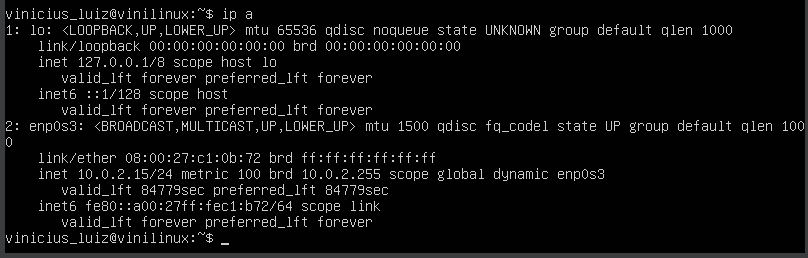
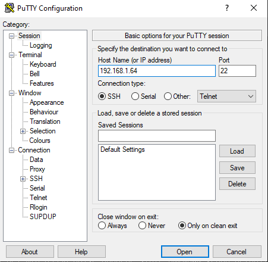
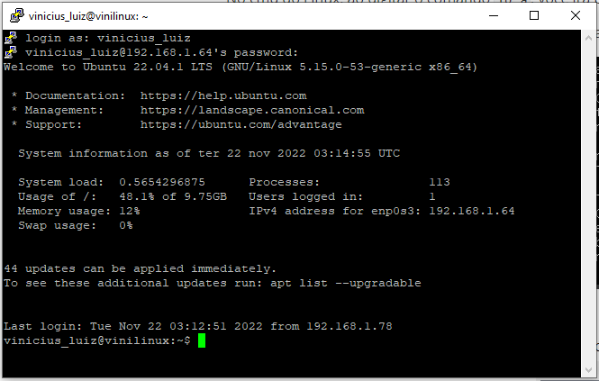
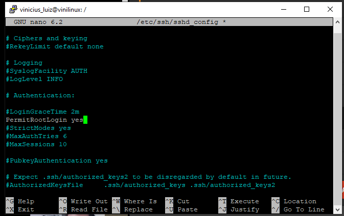
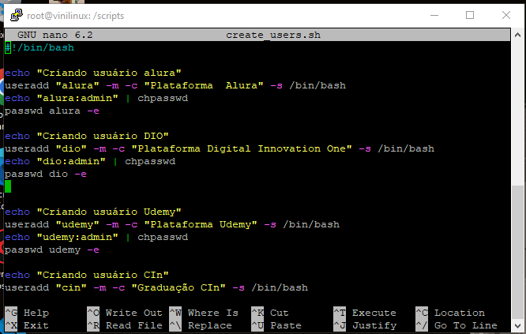
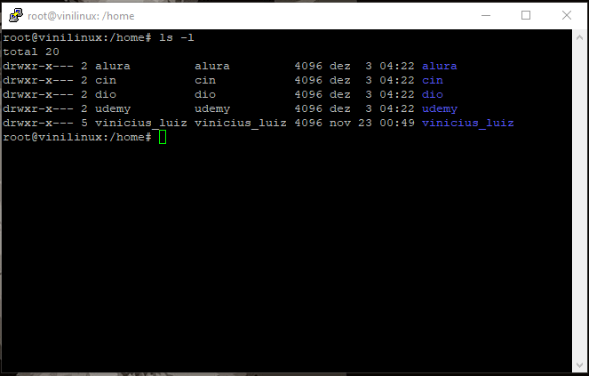
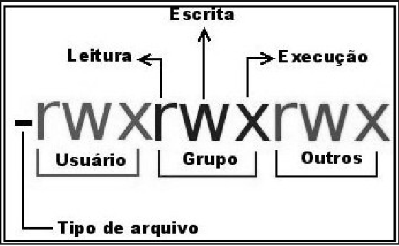
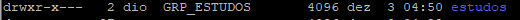
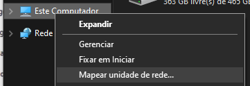

# Sistema Operacional

O **Sistema operacional** é um software, ou conjunto de software, que tem a função de administrar e gerenciar os recursos de um sistema. Esses recursos são: componentes de hardware, arquivos, programas de terceiros, etc.

A principal **função** do SO é estabelecer uma interface entre o hardware e o usuário.

## KERNEL ou núcleo do SO

É a ponte entre **usuário** e o **hardware**. O kernel compõe a parte central do SO e responde por tarefas cruciais, como:

- Estabelecer a camada de abstração de baixo nível (linguagem de máquina) com o hardware
- Gerenciar recursos como processador, RAM, dispositivos de entrada e saída, arquivos
- Gerenciar processos de programas
- Gerenciar o uso de dispositivos, memória do sistema e chamada de programas, definindo prioridades

## Linux

É um dos SO mais populares e é amplamente utilizado no segmento de **servidores** e por **desenvolvedores de software**. Ainda existe um grande espaço para crescimento no segmento de computadores pessoais.

O Linux está disponível gratuitamente e pode ser usado por qualquer pessoa, sem restrições.

## Distribuições

Distribuição Linux é um pacote que consiste em um kernel Linux, mais uma seleção de aplicativos mantidos por uma empresa ou comunidade de usuários. O objetivo de uma distribuição é otimizar o kernel e os aplicativos que rodam no sistema operacional para um determinado tipo de uso ou grupo de usuários.

Ex: ubuntu; Red Hat; Suse; fedora.

## Sistemas embarcados

Os sistemas embarcados são uma combinação de hardware e software projetados para cumprir uma função específica dentro de um sistema maior. Normalmente fazem parte de outros dispositivos e ajudam a controlá-los. Podem ser encontrados em aplicações automotivas, médicas e até militares. O Android é um SO móvel desenvolvido principalmente pelo Google. A empresa inicialmente criou um SO destinado a rodar em câmeras digitais.

# Modelo Cliente-Servidor

 </img>

É uma estrutura de aplicação que distribui as tarefas e cargas de trabalho entre os fornecedores de um recurso ou serviço, designados como servidores, e os requerentes dos serviços, designados como clientes.

# Acesso remoto a VM

Devemos instalar um serviço de acesso remoto ativo no Linux

`sudo apt-get install openssh-server`

No cmd do Linux, ao digitar o comando `ip a`, você irá buscar o IP contido em: **enp0s3** > **inet**  

Só irá funcionar se sua máquina física estiver na mesma faixa de IP da VM.

</img>

Insira o IP encontrado no PuTTY

</img>

Agora você consegue acessar remotamente

</img>

# Trabalhando com arquivos

- `pwd`: localização atual
- `cd`: mover entre pastas
- `ls`: listar arquivos
- `ls | more`: lista arquivos como uma lista
- `ls p*`: procurar todos os arquivos que iniciam com
- `ls arquivo[n1-n2]`: retorna range de arquivos
- `find -name arquivo`: procura arquivos

- `touch [a]`: criar arquivo
- `mkdir arquivo`: cria diretório 
- `rmdir`: remove diretório
- `rm arquivo`: remove arquivo
  - `rm -rf`: remove de modo cascata arquivo e pastas

- `[tab]2x`: lista as subpastas dentro da pasta
- `man [command]`: ajuda em forma de arquivo
- `cat`: visualizar arquivo de texto
- `sudo [command]`: executar comando como administrador

# Logando como Admin

1. `sudo passwd root`: Para Ubuntu, ele pede para definir uma senha ao usuário *root*
2. `su`: loga como admin
3. `su [nome_usuario]`: logar como qualquer outro usuário

# Liberando login Root via acesso remoto

1. `nano`: edita arquivo de texto
2. `sudo nano /etc/ssh/sshd_config`: editar atributo que permite login via acesso remoto
3. `reboot` ou  `restart sshd` para aplicar a alteração

</img>

# Trabalhando com arquivos de texto

- `vi [nomearquivo].txt`: se existir, então abre arquivo, senão, cria novo arquivo
  - `i`: modo edição
  - `esc`: sai do modo edição
  - `:wq`: salvar e sair
- `nano [nomearquivo]`: editor de texto mais conhecido; já abre no modo edição
- `cat [nomearquivo]`: ler arquivo de texto

# Trabalhando com usuários

## Criando usuário

`cat /etc/passwd`: visualiza todos os usuários

- `useradd [nome_usuario]` : criar usuário
  - `-m`: criar diretório na pasta home
  - `-c "nome do usuario"` : nome do usuário
  - `-s /bin/bash`: qual o bash do usuário
  - `-e  [DD/MM/YYYY]`: data de expiração da conta
  - `-p $(openssl passwd -crypt [senha])`: definir senha criptografada
  - `-G [NOME_GRUPO]`: associar usuário a um grupo **(sobrescreve grupos anteriores)**
- `passwd [nome_usuario]`: criar senha para usuário
  - `-e [DD/MM/YYYY]`: data de expiração da senha

- `userdel [nome_usuario]`: remover usuário
- `usermod [nome_usuario] [comando]`: editar configuração de usuário
- `echo "[usuario]:[senha] | chpasswd" \n  passwd [usuario] -e `: Definindo senha para usuário que expira após o primeiro acesso

## Criando usuários em lote

1. criar arquivo .sh: `nano [nome_arquivo].sh`
2. `#!/bin/bash` indica que está desenvolvendo u
3. </img>

4. `chmod +x [nome_arquivo].sh` Convertendo arquivo .sh em executável
5. `./[nome_arquivo].sh` executar 

# Manipulando grupos

`cat /etc/group` mostra os grupos existentes

- `usermod -G [grupo1,grupo2,grupon] [user]`: associando usuário a um grupo (sobrescreve grupos anteriores)
- `gpasswd -d  [nome_usuario] [NOME_GRUPO]`: remover usuário do grupo
- `groupadd [NOME_GRUPO]`: criando grupo
- `groupdel [NOME_GRUPO]`: removendo grupo

# Permissões no Linux

</img>

</img>

- `chown usuario:grupo arquivo`: mudar o dono de arquivos, diretórios e links.

</img>

| Permissão | Valor |
| --------- | ----- |
| R         | 4     |
| W         | 2     |
| E         | 1     |
| None      | 0     |

`chmod [somatorio_usuario][somatorio_grupo][somatorio_outros] [arquivo/pasta]` : altera as permissões de arquivos, diretórios e links.

</img>

</img>

# Infraestrutura como código: Script de criação de estrutura de usuários, diretórios e permissões.

IaC é o gerenciamento e provisionamento da infraestrutura por meio de código, em vez de processos manuais.  

Com a IaC, são criados arquivos de configuração que incluem as especificações da sua infraestrutura, facilitando a edição e a distribuição de configurações. Ela também assegura o provisionamento do mesmo ambiente todas as vezes.  

## Controle de versão

O controle de versão é uma parte importante da IaC. Os arquivos de configuração devem pertencer à fonte como qualquer outro código-fonte de software. Ao implantar o IaC, também é possível separá-la em módulos, que podem ser combinados de diferentes maneiras por meio da automação.  

# Mover arquivos máquina virtual para máquina local

`scp -P 22 [user_linux]@[ip_linux]:[source_directory] [target_directory]`

# Gerenciamento de pacotes

Pacote pode ser um software, driver, codec de vídeo. Quando vamos instalar, por exemplo, o Microsoft Teams, ele pode estar no repositório da própria Microsoft, como também, pode estar no repositório da distribuição Ubuntu.

Para o **Ubuntu**:

- `apt-get`: não é muito amigável, é mais baixo-nível. Se eu for criar um script para instalar uma série de softwares, é recomendável utilizar esse gerenciador de pacote porque ele não dará muito retorno do que está sendo feito.
- `apt`: possui uma interação com o usuário mais amigável.
  - `apt list -- installed`: Visualizar o que tenho instalado na máquina;
  - `apt list --upgradable`: Verificar atualizações disponíveis de softwares;
  - `apt search [nome] `: Pesquisar softwares;
  - `apt install [nome]`: Instalar softwares;
  - `apt update \n apt upgrade -y` : Atualização dos pacotes disponíveis **(-y não pergunta nada)**; 

# Gerenciamento de discos

Nas partições no Linux cada disco recebe um nome indicado por *sd* (sda, sdb, sdc...). Cada partição do disco é numerada. Exemplo: sda1, sda2, sda3, sdb1, sdb2...

</img>

- `lsblk`: Visualizar os discos
- `fdisk -l`: Visualizar os discos² (mostra a localização do disco)

## Adicionando novo disco

1. Criar novo disco rígido

</img>

</img>

2. `fdisk /dev/sdb` Criar uma ou mais partições. (o caminho deve ser o caminho do disco)
   1. `n` para adicionar nova partição
   2. `p` caso for a primeira partição
   3. Número de partições, setores e último setor são default 
   4. `w`para salvar
3. `mkfs.ext4 /dev/sdb`Formatar o disco
   1. ext4 é o sistema de arquivos padrão para o Linux Ubuntu
   2. Localização do disco
4. Montar disco
   1. É uma boa prática montar o disco na pasta `/mnt/`
   2. `mount /dev/sdb /mnt/[nome_pasta]`: Montar disco no diretório
      1. `umount /dev/sdb`: desmontar disco
      2. Ao desmontar, não se perde os arquivos dentro do disco

 	5. Montar disco automaticamente
          	1. `nano /etc/fstab`: script de montagem de discos
          	2. Na última linha, executar o comando:  `[local_disco] [local_montagem] [sistema_arquivo] defaults 0 0`
         	1. `/dev/sdb /disk_sdb ext4 defaults 0 0`

# Manipulando arquivos

- `cp [origem] [destino]`: Copiar arquivo
  - `-i`: pergunta antes de sobrepor os arquivos
  - `-r`: copia recursivamente (pasta dentro de pasta)
  - `-v`: modo verboso
- `mv [origem] [destino]`: Mover arquivo (se não especificar o nome do arquivo no destino, o nome será o mesmo da origem)
  - Modo recursivo não está disponível
  - É possível renomear arquivos

# Manipulando processos

- `ps aux`: Visualiza todos os processos ativos
- `kill [PID]`: mata o processo
- `killall [nome_processo]`: mata todos os processos pelo nome

- `w`: usuários logados
- `who -a`: visualizar PID dos usuários

# Servidor de Arquivos

**SAMBA** é um software que tem como principal finalidade o compartilhamento de arquivos de servidores Linux para consumo em computadores Windows. Desta forma, é possível utilizar o Linux como servidor de arquivos, servidor de impressão, entre outros e acessara estas informações através de computadores com Windows.  

É aconselhável separar os discos para o uso do SO e para o uso do compartilhamento de arquivos, para evitar a concorrência entre usuários e SO nesse disco.

## Instalação do SAMBA e configuração inicial

- `apt install samba -y`: instalar o SAMBA
- `cd /disk_sdb ` > `mkdir publico`: criando uma pasta pública
  - `chmod publico 777`: a pasta terá permissão full para todos os usuários
- `nano /etc/samba/smb.conf` Acessar o arquivo de configuração do SAMBA
- </img>
  - criar novo bloco de configuração `[publico]` e setar as seguintes configurações iniciais: **OBS: o bloco não precisa necessariamente ter o mesmo nome da pasta no parâmetros path**
    - `path`: caminho da pasta a ser compartilhada
    - `writable`: a pasta pode ter os arquivos editados
    - `guest ok`: todos que estrarem estarão OK
    - `guest only`: todos que entrarem serão considerados convidados
- `systemctl restart smbd`  : reiniciar o serviço do SAMBA
  - SAMBA é considerado um serviço, ele houve requisições. Serviços executados em segundo plano são chamados de DAEMON no Linux. Por ser um DAEMON, o SAMBA terá o sufixo **d**.
- `systemctl status smbd`: Verificar status do serviço SAMBA
- `systemctl enable smbd`: O serviço do SAMBA não reinicia sozinho ao ligar o servidor Linux. Este comando configura o início do serviço ao ligar o Linux

## Configurando o acesso via máquina cliente

- </img>
  - Mapear nova unidade de rede
- </img>
  - Configurar o IP do servidor Linux e a pasta. **O nome da pasta é o mesmo nome do bloco de configuração do SAMBA.**

# Servidor WEB

Servidor web é um software responsável por aceitar pedidos em HTTP de clientes, geralmente os navegadores e serviços com respostas em HTTP, incluindo opcionalmente dados, que geralmente são páginas web.

## Instalando apache2

`apt install apache2 -y`: instalando o apache2. A partir dessa instalação, o servidor web já está funcionando.

</img>

# Servidor de Banco de Dados

Servidores de banco de dados fornecem um ambiente multiusuário onde muitos usuários podem acessar o banco de dados simultaneamente, mantendo a segurança e ocultando o sistema de gerenciamento dos clientes.

`apt install mysql-server-8.0 -y`: Instalar MySQL

`mysql -y [usuario] -p`: acessar banco de dados

`show databases`: Ver todos os banco de dados criados

`create database [database_name]`: criar banco de dados

`use [database_name]`: acessar um banco de dados
